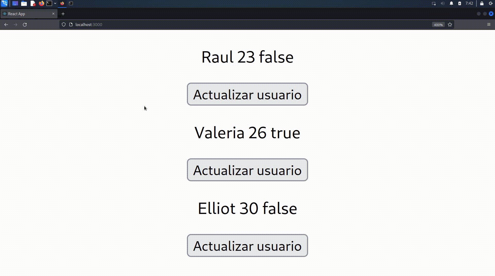

# Instrucciones
Modifica el archivo src/App.js para que permita la siguiente interacción

## Especificaciones técnicas
- Crear un componente llamado "InfoUsuarios"
- Definir un state en "InfoUsuarios" con los siguientes datos:
  - usuarios_online: Int
  - usuarios_offline: Int
  - usuarios: Arreglo de 3 objetos (Objeto definido a continuación)
    - nombre: String
    - edad: Int
    - online: String "true"/"false"
- Crear otro componente llamado "DetalleUsuario"
- Invocar "DetalleUsuario" dentro del componente "InfoUsuarios" para cada elemento en el arreglo usuarios y enviar la información de dicho elemento (Es decir, invocar "DetalleUsuario" 3 veces).
- DetalleUsuario debe cachar la información de "InfoUsuarios" y mostrar en pantalla su nombre, edad y online, además debe mostrar un botón "Actualizar usuario"
- Cuando se da click en "Actualizar usuario" se debe modificar el nombre del usuario agregando un "_(número de veces actualizado)" por ejemplo: nombre original "Mitsiu" después de un click en "Actualizar usuario" se modifica a "Mitsiu_1", si se dan dos clicks el nombre será "Mitsiu_2" (únicamente es requerido que se modifique el nombre en el componente "DetalleUsuario") 

AEEF
- Modificar el comportamiento del botón “Actualizar usuario” para que modifique la edad incrementandola      
JVDM
- Filtrar el arreglo usuarios para solo mostrar los usuarios que online sea true      
EHM
- Quitar el atributo “edad” en el arreglo de objetos del bullet dos
LADP
- Separar los botones para que estén en un componente diferente llamado “ModificarUsuario”
JAD
- Modificar la lógica del boton “Actualizar usuario” para que aumente la edad en lugar de modificar el nombre
ADCR
- Realizar el ejercicio únicamente empleando arrow functions
JPMM
- Realizar el ejercicio solo siguiendo las instrucciones antes mencionadas
AMMS
- Modificar la lógica del botón “Actualizar usuario” para que reste numeros; Mitsiu, Mitsiu_-1, Mitsiu_-2…
SMCR
- Crear un tercer componente que en etiquetas h1 muestre la cantidad de usuarios totales (usuarios_online + usuarios_offline)
CMML
- Agregar el atributo “plataforma” en el bullet dos, su valor es un string
IABM
- Agregar un segundo botón “Actualizar edad” que sume +1 cada vez que es presionado
DBS
- Modificar los nombres de los componentes de “InfoUsuarios” a “Info” y de “DetalleUsuario” a “Detalle”
JARZ
- Agregar dos elementos más al arreglo usuarios (5 elementos en total)
AJJD
- Quitar los atributos usuarios_offline y usuarios_online del bullet dos
AGO
- Realizar el ejercicio sin ninguna modificación de las instrucciones
LANT
- Quitar un elementos más al arreglo usuarios (2 elementos en total)
AFM
- Realizar el ejercicio únicamente 
LROM
- Usar únicamente arrow functions
EDPF
- Filtrar el arreglo de usuarios y solo mostrar los usuarios cuya edad sea mayor a 12
ONCR
- Hacer que toda la lógica y states sean a cargo de InfoUsuarios, DetalleUsuario sólo muestra información y cacha clicks
JAHH
- Emplear la función Array.map para invocar “DetalleUsuario”
JAPM
- Agregar el atributo “ultimo_login” a cada elemento en el arreglo “usuarios” con un valor númerico, use unixtimestamps
JALM
- Crear un componente “ActualizarU” que contenga el botón “Actualizar Usuario”.
OAE
- Realizar el ejercicio tal como se describe en la instrucción 1, sin ninguna modificación
MACM
- Hacer que toda la lógica y states sean a cargo de InfoUsuarios, DetalleUsuario sólo muestra información y cacha clicks

## Aspectos a evaluar
- Arquitectura de componentes (1 punto)
- Manejo correcto de state (2 puntos)
- Envío y recepción correcto de propiedades entre componentes (2 puntos)
- Nombres de variables apropiados (0.5 puntos)
- Uso de estilo de código unificado (0.5 puntos)
